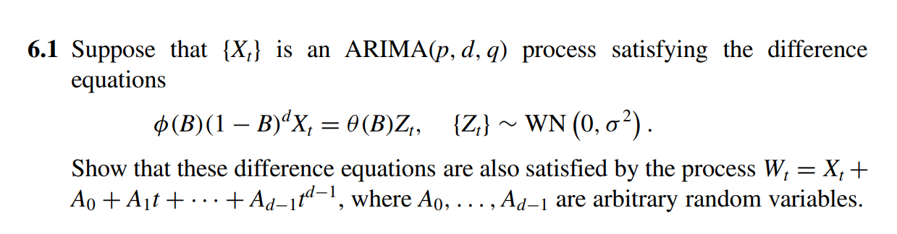
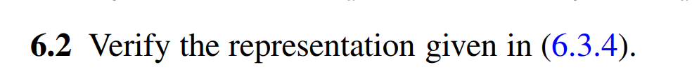
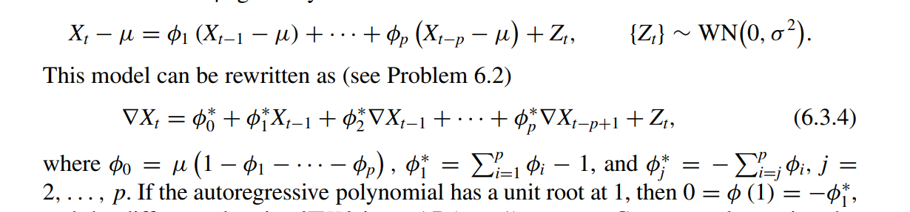
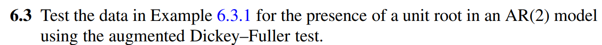

# Chapter 6 exercises

$$
\phi(B) = 1 + \phi_1 B + \phi_2 B^2 + ... + \phi_p B^p

$$

and

$$
\theta(B) = 1 - \theta_1 B - \theta_2 B^2 - ... - \theta_q B^q

$$

We have 

$$
\begin{align}
		\phi(B)(1-B)^d W_t &= \phi(B) (1-B)^d (X_t + A_0 +A_1t + ... + A_{d-1}t^{d-1}) \\
		   		   &= \theta(B)Z_t + \phi(B) (1-B)^d (A_0 +A_1t + ... + A_{d-1}t^{d-1} 
\end{align}
$$

We know that if we apply the backward operator on a polynolial of $d$ degree, we will receive the one of $d-1$ degree which results in the vanishing of the second term in the $(2) $ equation.

We have the following model:

$$
X_t - \mu = \phi_1 (X_{t-1} - \mu) + ... + \phi_p(X_{t-p} - \mu) + Z_t, \quad {Z_t} \sim WN(0, \sigma^2)
$$

Subtract both sides by $X_{t-1}$,

$$
X_t - X_{t-1} = \mu - X_{t-1} + \phi_1(X_{t-1} - \mu) + \phi_2(X_{t-2} - X_{t-1} + X_{t-1} - \mu) \\+ ... + \phi_p (X_{t-p} - X_{t-p+1} + X_{t-p+1} - ...  - X_{t-1} + X_{t-1}) + Z_t
$$

which is equivalent to

$$
\nabla X_t = \mu - X_{t-1} + \phi_1(X_{t-1} -\mu) + \phi_2 (-\nabla X_{t-1} + X_{t-1} -\mu) + ..+ \\
			+\phi_p(-\nabla X_{t-p} - \nabla X_{t-p+1} - ... - \nabla X_{t-1} + X_{t-1} - \mu) + Z_t
$$

by a simple algebraic transformation

$$
\nabla X_t = \mu(1 - \phi_1 - ... - \phi_p) + (\phi_1 + \phi_2 + ... + \phi_p - 1)X_{t-1} + \\
				(-\phi_1 - \phi_2 - ... - \phi_p) \nabla X_{t-1} +  (-\phi_2 - \phi_3 - ... - \phi_p) 
				\nabla X_{t-2}... + (-\phi_p) \nabla X_{t-p} + Z_t
$$

and we have $(6.3.4) $ representation.

